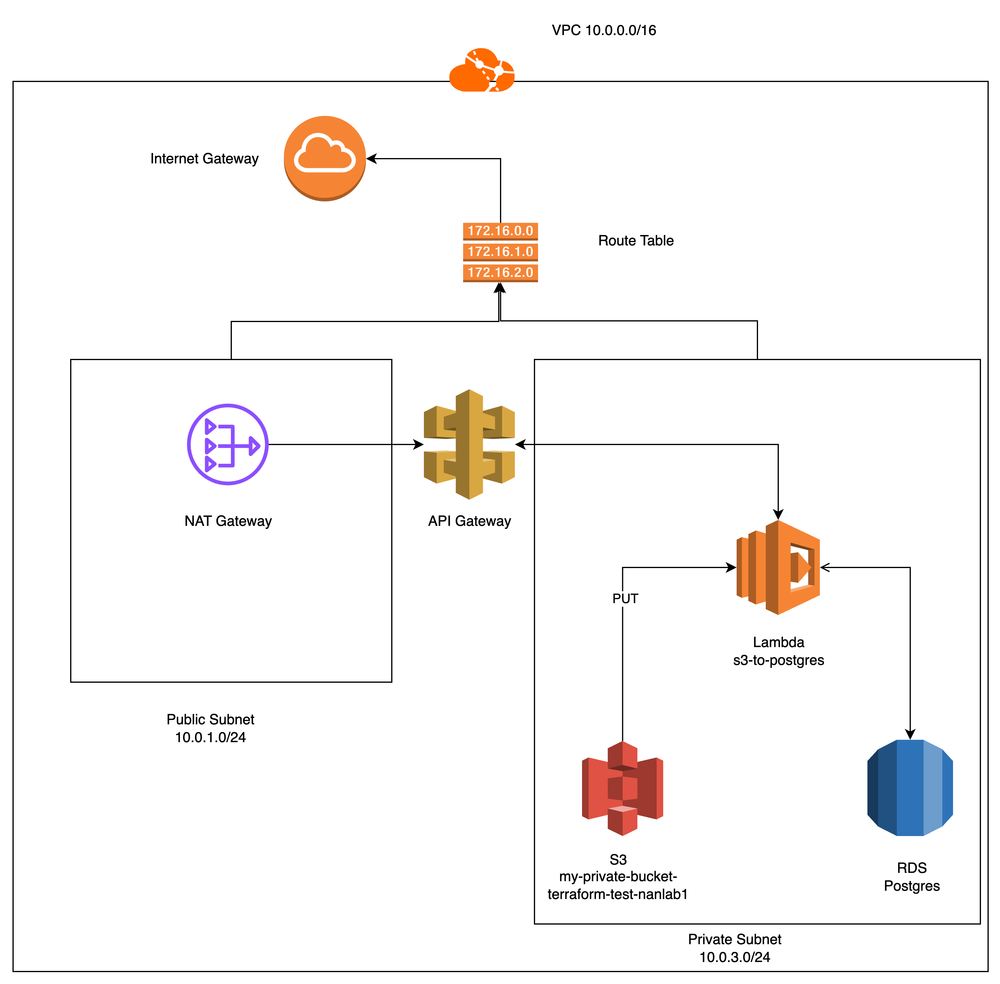
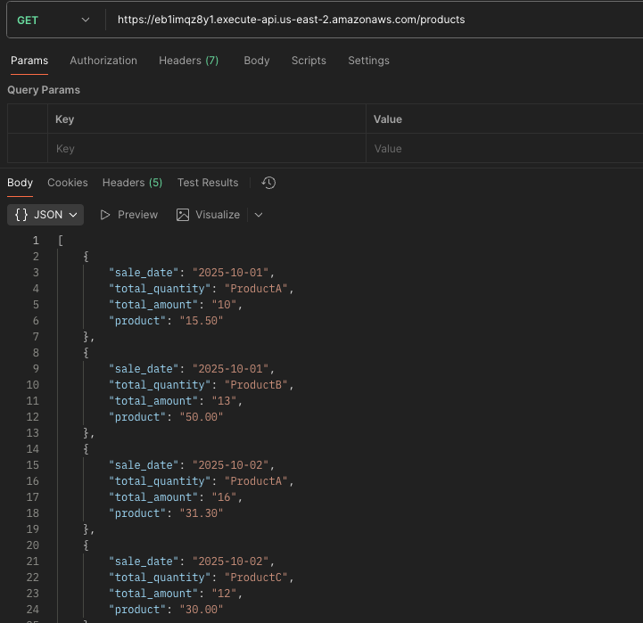

# Serverless ETL Pipeline with Terraform

This project provisions a fully serverless data ingestion and analytics system on AWS using Terraform.
It creates the following components:

* Amazon S3 – to store uploaded CSV files
* AWS Lambda – triggered by S3 PUT events, aggregates sales data and inserts into PostgreSQL
* Amazon RDS (PostgreSQL) – stores aggregated sales results
* Amazon API Gateway – exposes a REST endpoint to retrieve the aggregated data
* Networking (VPC, Subnets, Security Groups) – ensures resources are deployed in private subnets
* IAM Roles & Policies – provide secure and least-privilege access between services

## Diagram




## Folder Structure

```
lambda.zip/                     # lambda.zip(it can be versioned for future changes)
├── main.tf                     # Root module to call all submodules
├── provider.tf                 # AWS provider configuration and region setup
├── lambda_iam_role.tf          # Iam role with perssions for lambda 
├── modules/
│   ├── api_gateway/            # Module API Gateway setup and Lambda integration
│   │   ├── main.tf
│   │   └── variables.tf
│   ├── lambda_s3/              # Module Lambda function
│   │   ├── main.tf
│   │   ├── outputs.tf
│   │   └── variables.tf
│   ├── network/                # Module VPC, subnets, route tables, and NAT gateway setup
│   │   ├── main.tf
│   │   ├── outputs.tf
│   │   └── variables.tf
│   ├── rds/                    # Module RDS instance and subnet group
│   │   ├── main.tf
│   │   ├── outputs.tf
│   │   └── variables.tf
│   └── security/               # Module Security groups
│       ├── main.tf
│       ├── outputs.tf
│       └── variables.tf
```

# Module and folders* Overview
| Module/Folder  |	Description |
|:-------:| :----------:|
|network	| Creates a VPC with public and private subnets across 2 Availability Zones. |
| security	| Manages security groups for Lambda and RDS access.|
| lambda_s3	| Builds and deploys the Lambda function from an S3 zip package.|
| rds	| Deploys a PostgreSQL RDS instance in private subnets.|
| api_gateway	| Configures an API Gateway to expose the Lambda endpoint.|
| lambda* | Configurates the lambda function and its requirements|
| data* | Contains a csv file for testing and sql script to create the table.|

## Package Lambda Function

Create virtual environment with the corresponding engine python3.11 for this case
```
python3.11 -m venv venv
source venv/bin/activate
```

Install requirements
```
cd lambda
pip install requirements.txt -t .
```

Create deployment package
```
zip -r9 ../lambda.zip .
cd ..
```

## Testing

Upload file:
```
aws s3 cp sales.csv s3://my-private-bucket-terraform-test-nanlab1/
```

Calling API gateway:


